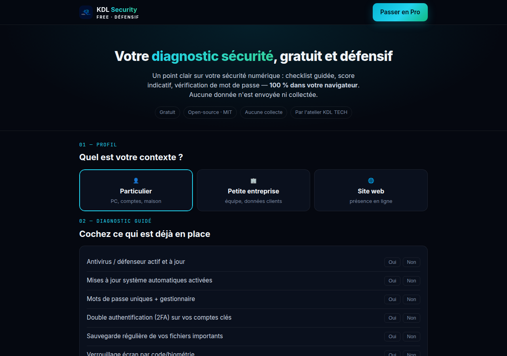

**Français** · [English](README.en.md)

# KDL Security Free

Un diagnostic de sécurité guidé, pour les particuliers et les petites
entreprises. Une seule page HTML, aucun serveur, rien ne sort du navigateur.

**[Ouvrir l'outil](https://security.kdl-tech.fr/free)** · ou téléchargez `index.html`
et ouvrez-le d'un double-clic. Il fonctionne hors ligne.



---

## Le problème qu'il règle

Les conseils de sécurité destinés au grand public sont soit terrifiants, soit
inutilisables. On vous dit d'« activer la double authentification » sans jamais
vous dire par quoi commencer, ni ce qui compte vraiment dans votre situation.

Cette page pose des questions concrètes, adaptées à votre contexte, donne un
**score indicatif sur 100**, et surtout **classe ce qu'il faut corriger en
premier**.

> ⚠️ **Indicatif et pédagogique.** Ne remplace pas un audit professionnel.

## Ce qu'il fait

| | |
|---|---|
| **Trois profils** | particulier, petite entreprise, site web — les questions s'adaptent |
| **Liste de contrôle guidée** | antivirus, mises à jour, mots de passe, 2FA, sauvegardes, verrouillage |
| **Score sur 100** | avec les priorités classées, pas une simple note |
| **Test de mot de passe** | entropie calculée localement, jamais transmise |
| **Rapport téléchargeable** | généré dans le navigateur |

## Pourquoi vous pouvez lui faire confiance

**Il n'y a aucun serveur où envoyer quoi que ce soit.** Pas de dépendance, pas de
traceur, pas de cookie, pas de compte. Tout est en HTML, CSS et JavaScript dans
un seul fichier — vous pouvez lire chaque ligne avant de lui confier quoi que ce
soit.

Pour un outil de sécurité, c'est la moindre des choses : un logiciel qui vous
demande d'évaluer vos mots de passe et qui appellerait un serveur au passage
serait exactement ce contre quoi il prétend vous protéger.

Le test de mot de passe estime l'entropie **dans votre navigateur**. Rien n'est
envoyé, rien n'est enregistré, rien ne subsiste après la fermeture de l'onglet.

## Ce qu'il ne fait pas

Il ne scanne pas votre machine, ne détecte aucun virus et ne vérifie pas si vos
comptes ont fuité. Il vous fait un **état des lieux déclaratif** : ce qu'il vaut
dépend de l'honnêteté de vos réponses.

Il ne remplace pas un audit. Un score de 100/100 ne veut pas dire que vous êtes
invulnérable — il veut dire que les bases sont en place.

## Utilisation

Ouvrez `index.html` dans un navigateur. Ou servez le dossier :

```bash
python3 -m http.server 8080
```

## Contribuer

Les ajouts les plus utiles sont des points de contrôle qui reflètent un risque
réel pour une petite structure — pas des recommandations de laboratoire. Ouvrez
une *issue* avec le risque concret que le point permet d'éviter.

## Licence

MIT. Reprenez-le, adaptez-le, intégrez-le à vos propres outils.

---

Par [**KDL TECH**](https://kdl-tech.fr) — maintenance informatique,
développement, sécurité. Guadeloupe et à distance.
